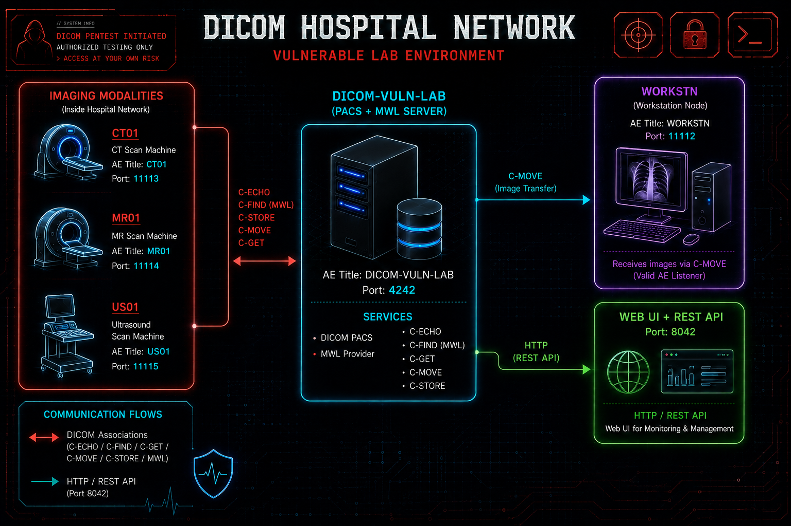

# DICOM-VULN-LAB - Damn Vulnerable DICOM Lab

An intentionally vulnerable DICOM environment built on top of
[Orthanc](https://www.orthanc-server.com/)'s PACS server. It mimics a small
hospital DICOM network, with a PACS + Modality Worklist server, CT/MR/US
modalities, and a workstation, seeded with synthetic patients, studies, and
scheduled orders, so you can practice identifying and exploiting weakly
configured DICOM deployments.

> [!WARNING]
> - For education and authorized testing only.
> - All data is synthetic; there is no real PHI/PII in this lab.
> - Never host this lab on a hospital network or any network with access to real patient data.
> - The default configuration is intentionally vulnerable and is **not** suitable for production use.
> - Run it only on infrastructure you own or are authorized to test. You are solely responsible for any harm caused by how you use it.

## What's inside

- **Orthanc's** PACS server serving both Query/Retrieve and Modality Worklist on one node
  (AET `DICOM-VULN-LAB`, DICOM port `4242`).
- **Web UI** at http://localhost:8042 (creds: `admin` / `admin`) for browsing
  and managing the node over HTTP.
- **Modality/workstation AEs** (`WORKSTN`, `CT01`, `MR01`, `US01`) mimicking
  a CT scanner, MR scanner, ultrasound machine, and a workstation on a
  typical hospital DICOM network.
- **DCMTK** client tools available inside the container.
- **Pre-baked synthetic dataset**: 8 patients, 54 image instances across different modalities, and 14 worklist items.

## Architecture Diagram



## Application Entities Summary

| Application Entity | Port         | Purpose                                                        |
|---------------------|--------------|-----------------------------------------------------------------|
| `DICOM-VULN-LAB`    | 4242         | DICOM PACS + MWL server (C-ECHO/FIND/GET/MOVE/STORE, worklist) |
| `WORKSTN`           | 11112        | Workstation node mimicking a valid C-MOVE destination          |
| `CT01`              | 11113        | CT scanner                                                      |
| `MR01`              | 11114        | MR scanner                                                      |
| `US01`              | 11115        | Ultrasound scanner                                              |
| -                   | 8042         | HTTP REST API + web UI                                          |

## Requirements

- Docker, the only thing you need on the host to build and run the lab.
- An "attacker" machine with DCMTK installed (optional; the same tools are
  already available inside the container, reachable via `docker exec`).

## Build

```bash
sudo docker build -t dicom-vuln-lab .
```

## Run

```bash
sudo docker run --rm -it \
  -p 4242:4242 -p 8042:8042 -p 11112-11115:11112-11115 \
  --name dicom-vuln-lab dicom-vuln-lab
```

The web UI is at http://localhost:8042 (user `admin`, password `admin`).

## Exploring the Lab

A walkthrough of interacting with the vulnerable DICOM server: querying and
retrieving patient studies, then modifying one and uploading it
back to the server.

```bash
# Entering docker shell (optional if dcmtk already installed on the host/attacking machine)
sudo docker exec -it dicom-vuln-lab /bin/bash

# connectivity
echoscu -v -aet PROBE -aec DICOM-VULN-LAB localhost 4242

# query studies
findscu -S -aet PROBE -aec DICOM-VULN-LAB localhost 4242 \
  -k QueryRetrieveLevel=STUDY -k PatientName= -k PatientID= \
  -k StudyDate= -k StudyInstanceUID= -k ModalitiesInStudy=

# query the worklist
findscu -W -aet PROBE -aec DICOM-VULN-LAB localhost 4242 \
  -k PatientName= -k AccessionNumber= \
  -k "ScheduledProcedureStepSequence[0].Modality=" \
  -k "ScheduledProcedureStepSequence[0].ScheduledProcedureStepStartDate="

# retrieve a study by UID (use a real UID from the findscu above)
mkdir received  # directory for storing retrieved studies
getscu -v -S -aet PROBE -aec DICOM-VULN-LAB localhost 4242 \
  -k QueryRetrieveLevel=STUDY -k StudyInstanceUID=<uid> \
  --output-directory ./received

# move a study to a mimic AE (delivered to the workstation listener inside the container)
movescu -v -S -aet PROBE -aec DICOM-VULN-LAB -aem WORKSTN localhost 4242 \
  -k QueryRetrieveLevel=STUDY -k StudyInstanceUID=<uid>

# For confirming if movescu downloaded the studies to the workstation 
sudo docker exec -it dicom-vuln-lab ls -la /data/received/WORKSTN

# Modifying an existing study and uploading back to the server
dcmodify -gst -gse -gin received/CT.1.2.826.0.1.3680043.8.498.19302764131231232520964555776562846344 

# Dumping meta data of the DICOM study file (StudyInstanceUID got changed creating new study)
dcmdump received/CT.1.2.826.0.1.3680043.8.498.19302764131231232520964555776562846344* 

# Uploading the modified study
storescu -v -aet STORESCU -aec DICOM-VULN-LAB localhost 4242 received/CT.1.2.826.0.1.3680043.8.498.19302764131231232520964555776562846344

```

## Vulnerable Configurations

The node ships permissive by design, giving you real weaknesses to find and
exploit:

1. **No AE-title-based access control.** `DicomCheckCalledAet` is `false`
   and the `DicomAlwaysAllow*` flags are all `true`, so the node accepts
   C-ECHO, C-FIND, C-GET, C-MOVE, C-STORE, and worklist queries from any
   calling AE title, without verifying who it claims to be. To enforce
   AE-title-based access (and observe operations being refused instead),
   edit `config/orthanc.json`: set `DicomCheckCalledAet` to `true` and the
   `DicomAlwaysAllow*` flags to `false`, then rebuild.
2. **No transport encryption.** Both the DICOM (`4242`) and HTTP (`8042`)
   ports are plaintext; there is no TLS configured, so traffic - including
   the web UI's `admin`/`admin` credentials - can be sniffed on the network.
3. **No user identity negotiation.** The A-ASSOCIATE request carries no user
   identity field, so there is no authentication at the association layer;
   whatever access control exists is limited to the AE-title check above.
4. **No modality host verification.** `DicomCheckModalityHost` is `false`,
   so even with `DicomCheckCalledAet` enforced, Orthanc never confirms that
   a request claiming a registered AE title (e.g. `WORKSTN`) actually
   originates from that AE's configured IP in `DicomModalities`. Any host
   can claim any known AE title and be trusted as it. Set it to `true` to
   have the node verify the calling IP against the registered address.

## Regenerating the test dataset

The dataset is pre-baked in the testdata folder. To generate a different
dataset, run the included scripts on your host (requires `pydicom` and `numpy`),
then rebuild:

```bash
python3 scripts/generate_testdata.py --outdir testdata/studies --patients 8 --within-days 60
python3 scripts/generate_worklist.py --outdir testdata/worklists --count 14
```
## Removing the Lab

To tear the lab down, stop the container (it's auto-removed thanks to
`--rm`), then remove the built image and the base Orthanc image:

```bash
docker stop dicom-vuln-lab
docker rmi dicom-vuln-lab orthancteam/orthanc:24.10.1
```

## Notes

- Uploaded objects are filed by the UIDs inside them, so a new study appears
  automatically as long as its `StudyInstanceUID` (and `PatientID`, for a new
  patient) do not collide with the seeded set.

## Credits

This lab stands on two open-source DICOM projects:

- [Orthanc](https://www.orthanc-server.com/) - the free, lightweight DICOM
  server powering the PACS + Modality Worklist node.
- [DCMTK](https://dicom.offis.de/dcmtk.php.en) - the toolkit providing the
  client tools and mimic modality listeners used throughout this lab.

Check them out if you need a real DICOM server or toolkit for your own work.

## References

- [DICOM Protocol (PS3.7 - Message Exchange)](https://dicom.nema.org/medical/dicom/2017b/output/chtml/part07/PS3.7.html)
- [DICOM Security](https://www.dicomstandard.org/using/security)
- [DICOM User Identity Negotiation (PS3.7 - Section D.3.3.7)](https://dicom.nema.org/medical/dicom/2017b/output/chtml/part07/sect_D.3.3.7.html)
- [DICOM IOD Entity Relationship Model](https://dicom.nema.org/medical/dicom/2021b/output/chtml/part03/chapter_A.html)
